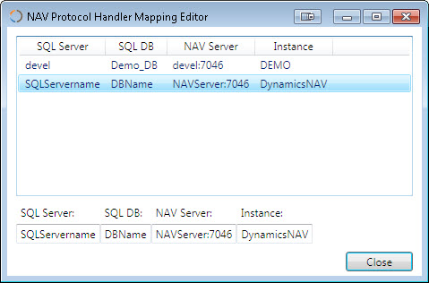

Installation

To install DynamicsNAV Protocol Handler, follow these steps:

# Download the app
# Place it into some folder of your choice
# Run the app as Admin
# Click "Activate" button to activate the protocol handler

Uninstallation

To uninstall the app, follow these steps:
# Run the app as administrator
# Click "Deactivate" button
# Delete the app/folder

Mappings

To be able to run correct RTC connected to correct server when using NAV 2009, the handler needs to know which NAV Server and instance to use for which SQL Server and DB. This is done through mappings. If this situation happens, user need to enter correct NAV Server address and Instance into the mapping window. 

After button "Close" is pressed, the mappings are saved into xml file. Name and path for this file could be changed in the .config file for application.

Settings

In application .config file you can change some behaviours of the application. Newly introduced settings are:
DisableMapping - if set to true, URI is sent as it is, without any mapping done
AutoMapping - enable automatic mapping of SQL Server name to NAV Server name and SQL DB to NAV Instance name (on default port 7046). It could help you when you have all NAV Service tiers installed on the SQL Server and named with same names as databases.
